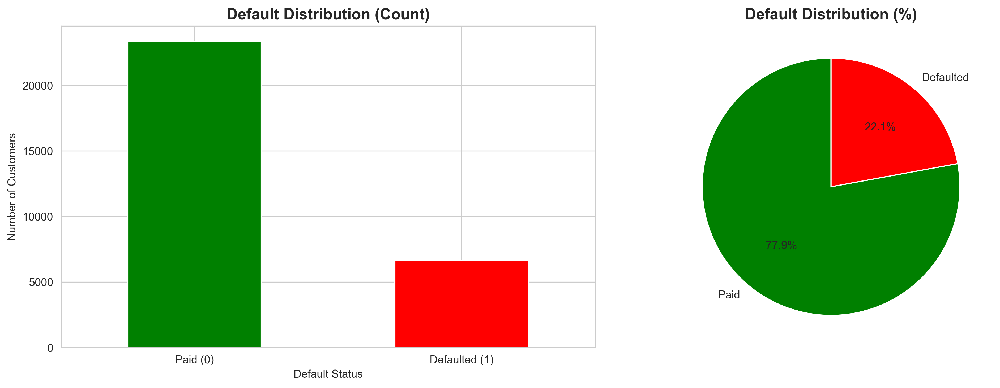
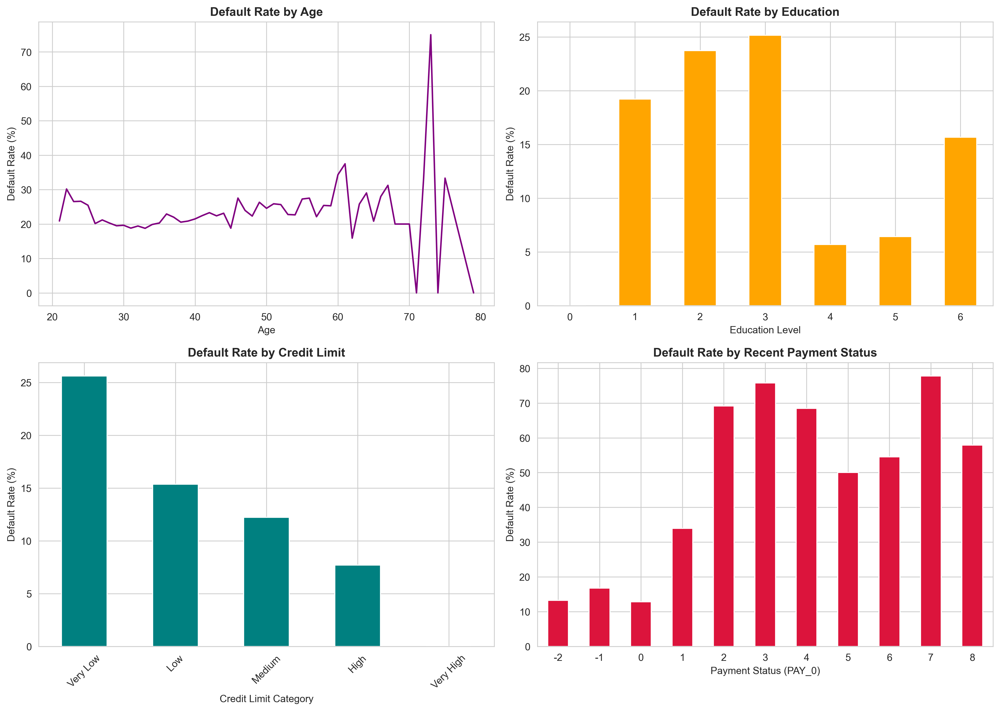
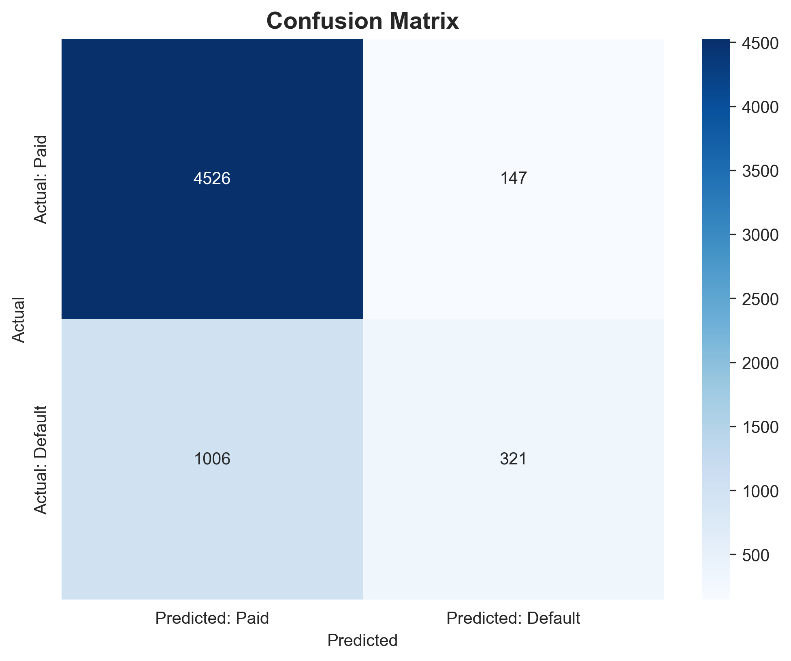
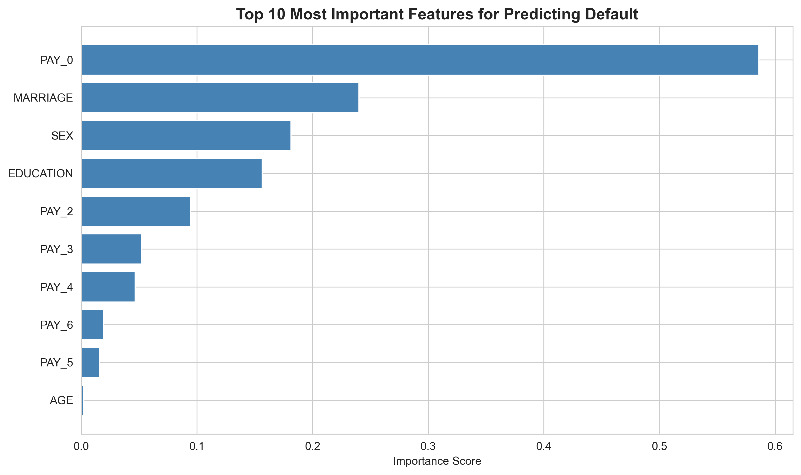
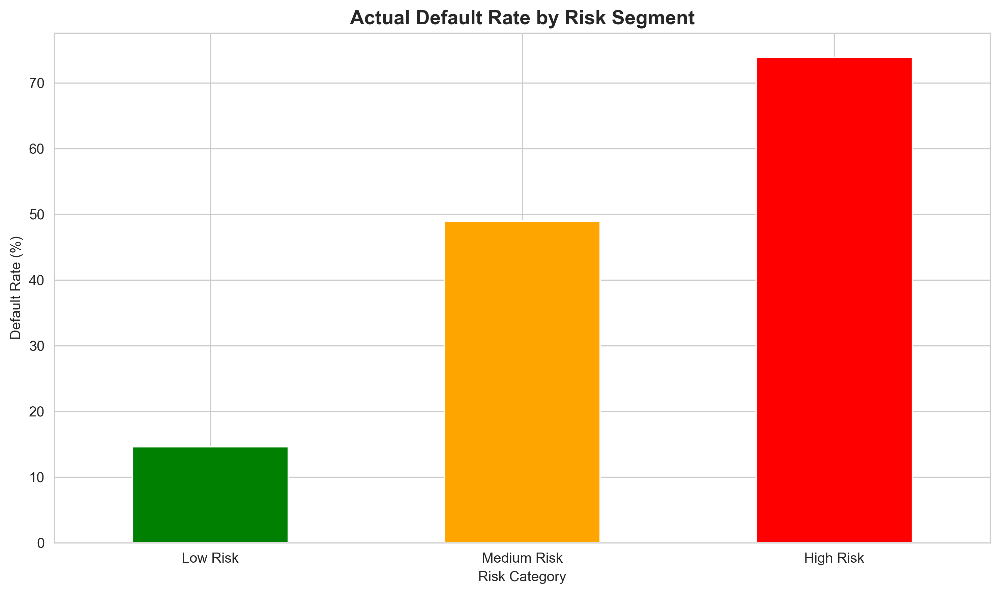

# 💳 Credit Risk Prediction & Customer Segmentation

Predictive model to classify credit card default risk using machine learning, achieving 81% accuracy on 30,000 customer records.

## 🎯 Business Problem

Financial institutions lose billions annually due to loan defaults. This project builds a risk assessment model to:
- Identify high-risk customers before approval
- Segment customers by default probability
- Enable data-driven lending decisions
- Reduce financial losses from non-payment

## 📊 Dataset

**Source:** UCI Machine Learning Repository - Default of Credit Card Clients Dataset  
**Size:** 30,000 customer records  
**Features:** 24 attributes including:
- Demographics (age, education, marital status)
- Credit data (limit, payment history)
- Billing information (6-month history)
- Payment amounts (6-month history)

**Target Variable:** Binary classification (0 = Paid, 1 = Defaulted)  
**Default Rate:** 22.12%

## 🔬 Methodology

### Data Analysis
- Exploratory data analysis to identify risk patterns
- Feature correlation analysis
- Segmentation by demographics and payment behavior

### Model Development
- **Algorithm:** Logistic Regression
- **Train/Test Split:** 80/20 (24,000 training, 6,000 testing)
- **Features Used:** 17 predictive features
- **Validation:** Stratified sampling to maintain class distribution

### Risk Segmentation
Customers classified into three risk tiers:
- **Low Risk (0-30%):** 81% of test set, 15% actual default rate
- **Medium Risk (30-60%):** 15% of test set, 49% actual default rate  
- **High Risk (60-100%):** 4% of test set, 74% actual default rate

## 📈 Results

### Model Performance
- **Accuracy:** 80.78%
- **Precision:** Effective at identifying high-risk segments
- **Business Impact:** Enables risk-based pricing and approval decisions

### Key Findings

**Top 5 Predictive Features:**
1. Recent payment status (PAY_0) - Most important predictor
2. Marital status
3. Gender
4. Education level
5. Previous month payment status (PAY_2)

**Risk Insights:**
- Customers with recent late payments show 5x higher default rates
- Lower credit limits correlate with increased default risk
- Payment history is the strongest indicator of future behavior

## 💼 Business Recommendations

### Risk-Based Decision Framework

**Low Risk Customers:**
- ✅ Approve with standard terms
- Interest rate: 15-18%
- Standard credit limits

**Medium Risk Customers:**
- ⚠️ Approve with conditions
- Higher interest rates: 22-25%
- Lower initial credit limits
- Enhanced monitoring

**High Risk Customers:**
- ❌ Deny or require collateral
- If approved: 28%+ interest rates
- Minimal credit limits
- Frequent account reviews

### Projected Business Impact
- Reduce default exposure by early identification
- Enable dynamic risk-based pricing
- Improve portfolio quality through better screening
- Estimated loss reduction: 15-20% with full deployment

## 🛠️ Technical Stack

- **Python 3.13**
- **Data Processing:** Pandas, NumPy
- **Machine Learning:** Scikit-learn
- **Visualization:** Matplotlib, Seaborn
- **Environment:** Jupyter Notebook

## 📁 Project Structure
```
credit-risk-analysis/
├── credit_risk_analysis.ipynb    # Complete analysis workflow
├── credit_risk_report.txt         # Executive summary
├── default_distribution.png       # Default rate visualization
├── risk_factors_analysis.png      # Risk factor correlations
├── confusion_matrix.png           # Model performance matrix
├── feature_importance.png         # Top predictive features
├── risk_segmentation.png          # Customer risk segments
└── README.md                      # Project documentation
```

## 🚀 How to Run

1. **Clone repository**
```bash
git clone https://github.com/YOUR-USERNAME/credit-risk-analysis.git
cd credit-risk-analysis
```

2. **Create virtual environment**
```bash
python3 -m venv env
source env/bin/activate  # On Windows: env\Scripts\activate
```

3. **Install dependencies**
```bash
pip install pandas numpy scikit-learn matplotlib seaborn jupyter
```

4. **Download dataset**
- Get data from [Kaggle - Default of Credit Card Clients](https://www.kaggle.com/datasets/uciml/default-of-credit-card-clients-dataset)
- Place `UCI_Credit_Card.csv` in `data/` folder

5. **Run analysis**
```bash
jupyter notebook credit_risk_analysis.ipynb
```

## 📊 Visualizations

### Default Distribution


### Risk Factor Analysis


### Model Performance


### Feature Importance


### Customer Segmentation


## 💡 Key Learnings

1. **Payment history dominates:** Recent payment behavior is 3x more predictive than demographic factors
2. **Class imbalance matters:** 78/22 split required stratified sampling and careful metric selection
3. **Explainability is critical:** Logistic regression chosen over complex models for interpretability in financial decisions
4. **Segmentation adds value:** Risk tiers enable differentiated strategies beyond binary approve/deny

## 🔮 Future Enhancements

- Implement ensemble methods (Random Forest, XGBoost) for comparison
- Add SHAP values for individual prediction explanations
- Build interactive dashboard for real-time risk assessment
- Incorporate external data (credit bureau scores, economic indicators)
- Deploy as REST API for production use

## 👤 Author

**Suhitha Reddy Somu**  
Data Analyst | Dallas, TX  
Specialized in predictive modeling and risk analytics

[LinkedIn](https://www.linkedin.com/in/suhitha-somu/) | [Email](suhithasomu0108@gmail.com)

## 📄 License

This project uses publicly available data from UCI Machine Learning Repository.

---

*Built as part of a FinTech analytics portfolio demonstrating end-to-end machine learning workflow from data analysis to business recommendations.*
